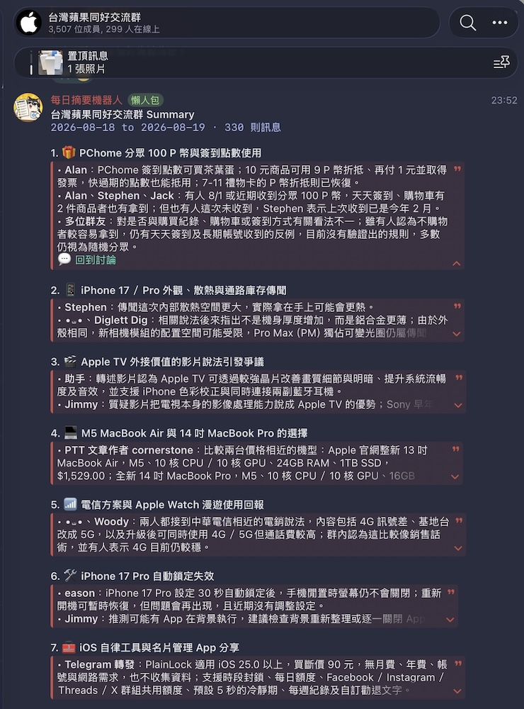

# Telegram 群組定期摘要機器人

這個 Bot 收集已授權 Telegram 群組中的文字訊息，依排程產生摘要。群組 owner 也可以手動摘要、預覽結果，或調整每個群組的設定。

## 功能

- 依 cron 排程自動發佈群組摘要
- 以 `/summary` 立即產生摘要，或指定時間範圍與主題
- 以 `/preview` 私訊預覽，不發佈到群組、不改變摘要進度
- 三種摘要風格：`normal`、`funny`、`roast`
- 僅接受 owner 加入的群組，避免在未知群組收集資料
- 使用者可私訊訂閱自己仍在其中的群組摘要
- 每個摘要主題附上可用的原始訊息連結
- SQLite 儲存訊息、群組設定與摘要進度

不會收集 Bot 訊息、貼圖、圖片、影片、語音、音訊、video note 或動畫。文字 caption 會被視為文字訊息。

## 輸出範例



## 快速啟動

### 1. 準備 `.env`

```bash
cp .env.example .env
```

請以 `.env.example` 作為完整設定範本，複製後只需先填入下列必填值：

- `TELEGRAM_BOT_TOKEN`
- `OPENAI_API_KEY`
- `OWNER_TELEGRAM_USER_ID`

### 2. 啟動容器

```bash
docker compose up -d --build
```

查看 log：

```bash
docker compose logs -f telegram-summary-bot
```

更新程式後重新建置：

```bash
docker compose up -d --build
```

資料庫保存在本機 `./data/bot.db`，Docker volume 會將它映射到容器內的 `/app/data/bot.db`。

## Telegram 與 BotFather 設定

1. 在 BotFather 建立 Bot，取得 `TELEGRAM_BOT_TOKEN`。
2. 在 BotFather 對 Bot 執行 `/setprivacy`，選擇 `Disable`。否則 Bot 通常只能收到指令，無法取得完整群組訊息。
3. 使用 `OWNER_TELEGRAM_USER_ID` 對應的帳號將 Bot 加入群組。
4. 將 Bot 設為群組管理員。Telegram 只有在 Bot 是管理員時，才會傳送 owner 與其他成員的狀態變更。
5. 若 owner 沒有親自加入 Bot，Bot 會私訊通知 owner 後離開群組，不會保存群組訊息。
6. owner 離開群組時，Bot 會撤銷授權後自行離開；owner 重新加入群組後，需重新加入 Bot。
7. owner 和要訂閱的使用者都需要先私訊 Bot 一次，Telegram 才允許 Bot 主動傳送私訊。

## 設定

所有設定都放在 `.env`，欄位名稱與預設值以 `.env.example` 為準。前 3 個欄位必填，其餘都有預設值。

| 環境變數 | 預設值 | 說明 |
| --- | --- | --- |
| `TELEGRAM_BOT_TOKEN` | 無 | BotFather 建立 Bot 後取得的 token |
| `OPENAI_API_KEY` | 無 | OpenAI API key |
| `OWNER_TELEGRAM_USER_ID` | 無 | 唯一可管理群組設定的 Telegram user id |
| `DEFAULT_TIMEZONE` | `UTC+8` | 新群組預設時區，例如 `UTC+8`、`Asia/Taipei` |
| `DEFAULT_CRON_EXPR` | `0 9 * * *` | 新群組預設排程，使用 5 欄 cron |
| `DEFAULT_MODEL` | `gpt-5.6-luna` | 新群組預設 OpenAI Responses API 模型 |
| `DEFAULT_REASONING_EFFORT` | `default` | 預設 reasoning 程度，可用 `default`、`none`、`minimal`、`low`、`medium`、`high`、`xhigh`、`max` |
| `SQLITE_PATH` | `/app/data/bot.db` | SQLite 資料庫路徑。使用 Docker 時若改動此值，也要調整 volume |
| `MAX_MESSAGES_PER_SUMMARY` | `10000` | 單次送給模型的最新訊息上限。超過時仍會顯示完整訊息總數 |
| `MIN_MESSAGES_TO_SUMMARY` | `8` | 自動摘要的最低訊息數 |
| `MAX_SUMMARY_GAP_HOURS` | `24` | 未達最低訊息數時，最久累積多久仍強制產生一次自動摘要 |
| `DAILY_USER_SUMMARY_LIMIT` | `0` | 一般使用者私訊摘要每日每群組額度；`0` 停用，正整數啟用 |
| `MESSAGE_RETENTION_DAYS` | `180` | 原始訊息保存天數，也限制帶時間範圍的手動摘要可查詢範圍 |
| `OPENAI_MAX_OUTPUT_TOKENS` | `25000` | 每次摘要與條件解析的輸出 token 上限。使用 reasoning 模型時通常需要較高值 |

`default` 不會傳送 reasoning 參數。若模型不支援指定的 reasoning 程度，Bot 會以模型預設值重試。

## 指令

### 僅擁有者

| 指令 | 說明 |
| --- | --- |
| `/start`、`/help` | 顯示指令說明 |
| `/summary` | 立即整理上次摘要後的訊息 |
| `/summary <條件>` | 依自然語言指定時間或主題，例如 `/summary 這兩週以來討論到露營的事情` |
| `/user_summary_history` | owner 私訊查看最近 20 筆一般使用者摘要請求 |
| `/preview` | 私訊預覽最近 24 小時的摘要 |
| `/status` | 顯示目前群組設定與摘要進度 |
| `/set_schedule <cron>` | 設定群組排程 |
| `/set_timezone <tz>` | 設定時區，例如 `UTC+8`、`Asia/Taipei` |
| `/set_model <model>` | 設定摘要模型 |
| `/set_reasoning <level>` | 設定 reasoning 程度 |
| `/set_style <normal\|funny\|roast>` | 設定摘要風格 |
| `/set_auto <on\|off>` | 開啟或關閉自動摘要 |

`/summary` 與 `/preview` 都必須在已授權群組中執行。手動摘要只要有文字訊息就會執行，不受 `MIN_MESSAGES_TO_SUMMARY` 限制。

### 一般用戶

| 指令 | 使用位置 | 說明 |
| --- | --- | --- |
| `/subscribe` | 私訊 Bot | 選擇要訂閱的已授權群組 |
| `/unsubscribe` | 私訊 Bot | 取消群組摘要訂閱 |
| `/summary <條件>` | 私訊 Bot | 選擇自己仍在其中的授權群組，產生私訊摘要 |

訂閱清單只會顯示 Bot 能確認使用者仍在其中的群組。因此 Bot 必須是可訂閱群組的管理員，才能可靠呼叫 Telegram 的成員查詢 API。無法確認時，Bot 不會顯示群組、不會建立訂閱。

只有**排程自動摘要**會私訊訂閱者。手動 `/summary`、帶條件的 `/summary <條件>` 與 `/preview` 不會通知訂閱者。Bot 會重用已產生的 HTML 摘要，不會增加 OpenAI API 呼叫；寄送前也會再次確認訂閱者仍是群組成員，離群者會自動取消訂閱。

設定 `DAILY_USER_SUMMARY_LIMIT` 為正整數後，一般使用者可私訊 `/summary <條件>`，再以按鈕選擇群組。結果只會私訊請求者，不會發佈到群組或改變群組摘要進度。額度以每位使用者、每個群組分開計算，並依該群組時區每日午夜重置；預設 `0` 代表停用此功能。owner 使用私訊摘要不限額。owner 可私訊 `/user_summary_history` 查看最近 20 筆一般使用者的 prompt、目標群組、時間與結果狀態。

## 排程與時區

`/set_schedule` 使用標準 5 欄 cron：

```text
分鐘 小時 日 月 星期
```

例如：

| cron | 執行時間 |
| --- | --- |
| `0 9 * * *` | 每天 09:00 |
| `0 */6 * * *` | 每 6 小時 |
| `30 9 * * 1` | 每週一 09:30 |

排程會依群組時區計算。`/status` 顯示的下一次執行時間是 UTC。

自動摘要若訊息數少於 `MIN_MESSAGES_TO_SUMMARY`，會繼續累積，不會更新摘要進度。當最早一則未摘要訊息的累積時間達到 `MAX_SUMMARY_GAP_HOURS`，仍會產生摘要，避免群組長時間沒有更新。

## 摘要風格

| 風格 | 語氣與取材 |
| --- | --- |
| `normal` | 中性、精簡，優先保留決策、結論、重要事實、待辦事項與分歧 |
| `funny` | 輕快有梗，但不犧牲重點，也不取笑個人 |
| `roast` | 台式垃圾話與吐槽，群組自願開啟的娛樂模式 |

三種風格都遵守同一份輸出契約：只根據對話內容、不杜撰事實、保留重要數字與專有名詞、清楚區分發言者，並且只使用對話紀錄中提供的 Telegram 討論連結。

`roast` 可以嘲諷對話中真實發生的行為，但不能針對種族、性別、性向、宗教或身心障礙等身分特徵攻擊。

## 資料保存與升級

- Bot 預設保留最近 180 天的原始訊息供摘要使用，可用 `MESSAGE_RETENTION_DAYS` 調整。
- `messages` 只保存 `user_id`，顯示名稱存於 `users` table。使用者改名後，歷史訊息會顯示最新名稱。
- 回覆關係會被保存，讓模型能辨識同時進行的不同討論串。
- 公開群組和超級群組可產生「回到討論」連結；一般私人群組沒有 Telegram 永久訊息連結。

舊版資料庫會在啟動時自動 migration。舊的 `messages.user_name` 會移至 `users` table，所有訊息會被保留；舊訊息沒有回覆關係，之後新收集的訊息才會開始保存。

群組只能由 owner 將 Bot 加入時自動授權。owner 或 Bot 離開群組時，Bot 會撤銷授權；請由 owner 重新加入 Bot。

## 常見問題

### Bot 看不到群組訊息

確認已在 BotFather 對 Bot 執行 `/setprivacy` 並選擇 `Disable`。也確認 Bot 是由 owner 加入群組。

### Bot 無法私訊預覽或訂閱摘要

先由 owner 或訂閱者私訊 Bot 並輸入 `/start`。Telegram 不允許 Bot 主動開啟從未互動過的私訊。

### 訂閱清單是空的

使用者必須仍在已授權群組中，且 Bot 必須有管理員權限以查詢成員資格。

## License

This project is licensed under the [MIT License](LICENSE).
